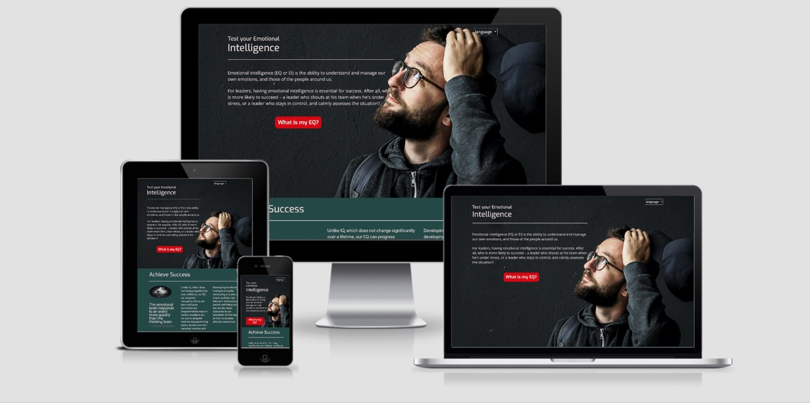

[website link](https://veraleitaodev.github.io/EQ_test/)

---

## Table of Contents

- [1.Project Summary](#1.Project-Summary)
- [2.UX](#2.UX)
  - [2.1.Strategy](#2.1.Strategy)
  - [2.2.Scope](#2.2.Scope)
    - [2.2.1.Current Features](#2.2.1.Current-Features)
    - [2.2.2.Future Features](#2.2.2.Future-Features)
  - [2.3.Structure](#2.4.Structure)
  - [2.4.Skeleton](#2.5.Skeleton)
  - [2.5.Surface](#2.6.Surface)
- [3.Technologies and Libraries](#3.Technologies-and-Libraries)
- [4.Resources and Tools](#4.Resources-and-Tools)
- [5.Tests](#5.Tests)
  - [5.1.Validation](#5.1.Validation)
  - [5.2.Manual Testing](#5.2.Manual-Testing)
- [6.Deployment](#6.Deployment)
- [7.Credits](#7.Credits)

---

## 1.Project Summary

I wanted to create more awareness to the importance of Emotional intelligenge.
A quizz would be, in my eyes, a good way to create engagement with the user. This site offers a brief introduction to what it is EQ and offers a quiz to create awareness on current EQ.
EQ test is a test to your Emotional Intelligence. Emotional Intelligence is as relevant or more than IQ for a successful, happy life.
This test is based on Daniel Goleman work about brain and behavioral sciences. The test had been replicated from Paulo Vieira books as he uses it to access the EQ before and after the subject of his books and course materials.

___

## 2.UX

### 2.1.Strategy

    #### color theme
    after chosing the images for the home page, I used Adobe Color to extract colour scheme matching the image on the first callout container.
        -- colours used:

### 2.2.Scope

#### 2.2.1.Current Features
        * Home page - to welcome user and provide a button to redirect to quiz
        * Responsive navigation - the site allows quality and uniform display in a vast range of screen sizes
        * On the top right corner it can be found a dropdown menu with the option of English and Portuguese language
        * Background image positioned to highlight headings and test button. 
        * Appealing button with 3d animation when hovered, with question "What is my QE?", that will take the user to a modal quiz about EQ.  
        * text to add interest and clarity regarding EQ. 
        * Sketch reinforcing the idea that it is needed both IQ and EQ to reach success. 
        * Subscribing card, although no back end, it provides the place for the user to submit email address in order to receive newsletter;
        * Footer with links for further reading
        * Social media icons with links directing to social media discussion the EQ topic

#### 2.2.2.Future Features
        * Add backend to Subscribing section
        * Add media to modal during questionaire to make it more interesting
        * Add on results section, areas that require improvement based on answers
        * Add useful links on results

### 2.3.Structure

### 2.4.Skeleton

### 2.5.Surface

___

## 3.Technologies and Libraries

        * HTML5 
           HTML5 is a markup language used for structuring and presenting content on the World Wide Web.
        
        * CSS3
           Cascading Style Sheets (CSS) is a style sheet language used for presentation of a markup language like HTML. (version 3)
        
        * [Font Awesome](https://fontawesome.com/) 
           CSS font and icon library kit. version 5 used
        
        * [Highcharts](https://www.highcharts.com/)
           Highcharts, a javascript based software library for charts

        * [Bootstrap 4](https://getbootstrap.com/)
           Free and open-source CSS framework for mobile first front-end web development

        * [Google Fonts](https://fonts.google.com/)
           Font catalogue with more than 135 languages and more than 1000 font families accessible to use on CSS via API

        * [JQuery](https://jquery.com/)
           Is a javascript library written in a simplified way "write less do more" style. version 3.5.1 used
        
        * [Github](https://github.com/)
           A host for software development and version control using Git.

        * [Gitpod](https://www.gitpod.io/)
           Gitpod is a cloud-based IDE (integrated development environment) that allowed me to write, run, and debug the code used for this project.
          
___

## 4.Resources and Tools
        
        * [Unsplash](https://unsplash.com/)
           Used photos obtained on [Unsplash](https://unsplash.com/) for this project, background photo on home page and profile image of a brain
        * [Dreamstime](https://dreamstime.com/)
           Obtained sketch image iq + eq from dreasmstime
        * [ami.responsivedesign.is](http://ami.responsivedesign.is/)
           used for mockup on top of readme page chowing website in different devices

        
___

## 5.Tests

### 5.1.Validation

### 5.2.Manual Testing
    * All javascript had been tested manually and simultanealy through preview via port 8000 (when using IDE gitpod): an issue found was that port would not show updates which led me to research and find that I needed to do hard reset or clear cache, which resolved the issue;
    * Used inspect development tool from google chrome and firefox web engines as both allow to inspect different size devices and the website was also tested in real devices (samsung note and samsung s9, ipad and laptop);
    * used a simple function whenever created a js file to test if file was linked with html file
    * Jquery and javascript tested with console.log commands throughout the project
    * known bug:
        • start, next and result buttons inside modal did not respond to .hide, when inspected realised that bootstrap class 'btn' was overriding class 'hide'. To resolve this issue added '!important' to display property of 'hide' class.
        • first used grid for modal buttons layout but it was not responsive so changes to rows and columns classes to take advantage of bootstrap responsive layout.
    * first drafts of the project included dropdown option but it was complicated a 1-10 answer as per original Paulo Vieira test and after been peer reviewed on slack it was suggested that radio buttons would be used instead. After analysing the different options I have decided to use radio buttons with likert scale (strongly disagree, disagree, neutral, agree, strongly Agree) as it would have a more intuitive response.

### 5. [Deployment](#deployment)

___

### 6. [Credits](#credits)  
    * https://www.w3schools.com/howto_css_modals.asp to help put together the quiz in modal 
    * https://www.youtube.com/watch?v=gLWIYk0Sd38 - used for modal as additional help 
    * overflow and padding code help takenfrom https://css-tricks.com/prevent-page-scrolling-when-a-modal-is-open/ to fix scroll bug when modal is open;  
    * about placeholder on select option form taken and adapted from https://www.tutorialrepublic.com/faq/how-to-make-a-placeholder-for-a-select-box-in-html.php#:~:text=Answer%3A%20Use%20the%20disabled%20and,element%20that%20has%20empty%20value.
    * first paragraph taken from website https://www.mindtools.com/pages/article/newLDR_45.htm in response to "What is Emotional Intelligence"
    * result text obtained from https://www.mindtools.com/pages/article/ei-quiz.htm and "manual do realizador" manual from Paulo Vieira as well as questions used;
    * [ami.responsivdesign.is](http://ami.responsivedesign.is) - multiple devices image in README.md file
    * https://stackoverflow.com/questions/46155/how-to-validate-an-email-address-in-javascript - provided code to validate an email address
    * credit to Valentin Salja for the [background photo](https://unsplash.com/photos/0aX51h4WvAk) used
    * credit to Alina Grubnyak for the [profile photo of a brain](https://unsplash.com/photos/tEVGmMaPFXk) 

### Acknowledgements

I have received inspiration for this project after reading about emotional inteligence and observed the work of motivational speakers.
Furthermore, I have received very precious help from my tutor Rhey Ann Magcalas and received great feedback from Malia Havlicek through slack, #peer review group.