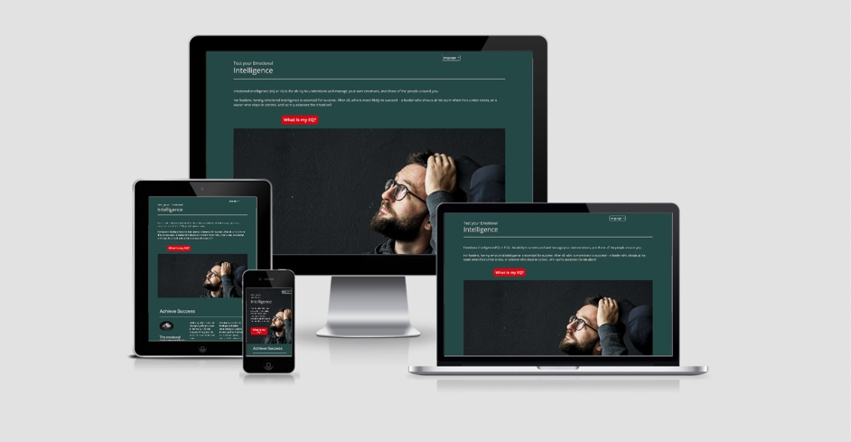

[website link](https://veraleitaodev.github.io/EQ_test/)

---

## Table of Contents

- [1.Project Summary](#1.Project-Summary)
- [2.UX](#2.UX)
  - [2.1.Strategy](#2.1.Strategy)
  - [2.2.Scope](#2.2.Scope)
    - [2.2.1.Current Features](#2.2.1.Current-Features)
    - [2.2.2.Future Features](#2.2.2.Future-Features)
    - [2.2.3.Ongoing Features](#2.2.3.Ongoing-Features)
  - [2.4.Structure](#2.4.Structure)
  - [2.5.Skeleton](#2.5.Skeleton)
  - [2.6.Surface](#2.6.Surface)
- [3.Technologies and Libraries](#3.Technologies-and-Libraries)
- [4.Resources and Tools](#4.Resources-and-Tools)
- [5.Tests](#5.Tests)
  - [5.1.Validation](#5.1.Validation)
  - [5.2.Manual Testing](#5.2.Manual-Testing)
- [6.Deployment](#6.Deployment)
- [7.Credits](#7.Credits)

---

## 1.Project Summary

I wanted to create more awareness to the importance of Emotional intelligenge.
A quizz would be, in my eyes, a good way to create engagement with the user. This site offers a brief introduction to what it is EQ and offers a quiz to create awareness on current EQ.
EQ test is a test to your Emotional Intelligence. Emotional Intelligence is as relevant or more than IQ for a successful, happy life.
This test is based on Daniel Goleman work about brain and behavioral sciences. The test had been replicated from Paulo Vieira books as he uses it to access the EQ before and after the subject of his books and course materials.

## 2.UX

### 2.1.Strategy

    #### color theme
    after chosing the images for the home page, I used Adobe Color to extract colour scheme matching the image on the first callout container.
        -- colours used:

### 2.2.Scope

#### 2.2.1.Current Features

        * Responsive navigation - the site allows quality and uniform display in a vast range of screen sizes
        * On the top right corner it can be found a dropdown menu with the option of English and Portuguese language
        * Background image positioned to highlight headings and test button. 
        * Appealing button with 3d animation when hovered, with question "What is my QE?", that will take the user to a modal quiz about EQ.  
        * text to add interest and clarity regarding EQ. 
        * Sketch reinforcing the idea that it is needed both IQ and EQ to reach success. 
        * Subscribing card, although no back end, it provides the place for the user to submit email address in order to receive newsletter;
        * Footer with links for further reading
        * Social media icons with links directing to social media discussion the EQ topic
#### 2.2.2.Future Features

#### 2.2.3.Ongoing Features

### 2.3.Structure

### 2.4.Skeleton

### 2.5.Surface

## 3.Resources and Tools

## 4.Technologies Applied

## 5.Tests

### 5.1.Validation

### 5.2.Testing

    -- used inspect tool from google chrome and firefox web engines as both allow to inspect different size devices
    -- used simple function in main.js to determine if page was working $(document).ready(function() {
    $("h1").css("text-decoration", "underline");
    -- when the h1 appeared underlined it was established that file was operational and linked to index.html file.
    -- jquery and javascript tested with console.log commands previous to coding functions
    -- user could select different times and answer to the same question and that would be stored which caused an error calculating results. To resolve this issue, the form element was hiden after selected answer and a message to press button would appear instead.
    -- known bug:
        • start, next and result buttons inside modal did not respond to .hide, when inspected realised that bootstrap class 'btn' was overriding class 'hide'. To resolve this issue added '!important' to display property of 'hide' class.

        • home page margins and overflow of background image colour and footer ...
        • first used grid for modal buttons layout but it was not responsive so changes to rows and columns classes to take advantage of bootstrap responsive layout.

### 5. [Deployment](#deployment)

### 6. [Credits](#credits)

list of websites used for inspiration:  
 --https://www.w3schools.com/css/css_background_shorthand.asp  
 --https://www.w3schools.com/howto_css_modals.asp
--https://www.youtube.com/watch?v=gLWIYk0Sd38 - used for modal  
 --overflow and padding code takenfrom https://css-tricks.com/prevent-page-scrolling-when-a-modal-is-open/ to fix scroll bug when modal is open;  
 --about placeholder on select option form taken and adapted from https://www.tutorialrepublic.com/faq/how-to-make-a-placeholder-for-a-select-box-in-html.php#:~:text=Answer%3A%20Use%20the%20disabled%20and,element%20that%20has%20empty%20value.
--https://api.jquery.com/ was a source used throughout this project as reference
-- first paragraph taken from website https://www.mindtools.com/pages/article/newLDR_45.htm in response to "What is Emotional Intelligence"
--result text obtained from https://www.mindtools.com/pages/article/ei-quiz.htm and "manual do realizador" manual from Paulo Vieira;
--[ami.responsivdesign.is](http://ami.responsivedesign.is) - multiple devices image in README.md file
--https://stackoverflow.com/questions/46155/how-to-validate-an-email-address-in-javascript - code to validate an email address
