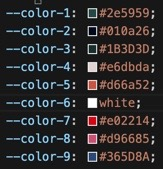

# EQ Test

EQ test is a test to your Emotional Intelligence. Emotional Intelligence is as relevant or more than IQ for a successful, happy life.
This test is based on Daniel Goleman work about brain and behavioral sciences. The test had been replicated from Paulo Vieira books as he uses it to access the EQ before and after the subject of his books and course materials.

[website link](#https://veraleitaodev.github.io/EQ_test/)

## Table of Contents

### 1. [UX](#ux).

    ####color theme
    after chosing the images for the home page, I used Adobe Color to extract colour scheme matching the image on the first callout container.
        -- colours used:

 
            
### 2. [Features](#features)
### 3. [Technologies Applied](#technologies-applied)
### 4. [Tests](#tests)  
    -- used inspect tool from google chrome and firefox web engines as both allow to inspect different size devices  
    -- used simple function in main.js to determine if page was working $(document).ready(function() {
    $("h1").css("text-decoration", "underline");  
    -- when the h1 appeared underlined it was established that file was operational and linked to index.html file.  
    -- jquery and javascript tested with console.log commands previous to coding functions
    -- known bug: 
        • start, next and result buttons inside modal did not respond to .hide, when inspected realised that bootstrap class 'btn' was overriding class 'hide'. To resolve this issue added '!important' to display code of 'hide' class...

        • home page margins and overflow of background image colour and footer ...
        • first used grid for modal buttons layout but it was not responsive so changes to rows and columns classes to take advantage of bootstrap responsive layout.  
        
### 5. [Deployment](#deployment)
### 6. [Credits](#credits)
list of websites used for inspiration:  
    --https://www.w3schools.com/css/css_background_shorthand.asp  
    --https://www.w3schools.com/howto_css_modals.asp
    --https://www.youtube.com/watch?v=gLWIYk0Sd38 - used for modal  
    --overflow and padding code takenfrom https://css-tricks.com/prevent-page-scrolling-when-a-modal-is-open/ to fix scroll bug when modal is open;  
    --about placeholder on select option form taken and adapted from https://www.tutorialrepublic.com/faq/how-to-make-a-placeholder-for-a-select-box-in-html.php#:~:text=Answer%3A%20Use%20the%20disabled%20and,element%20that%20has%20empty%20value. 
    --
